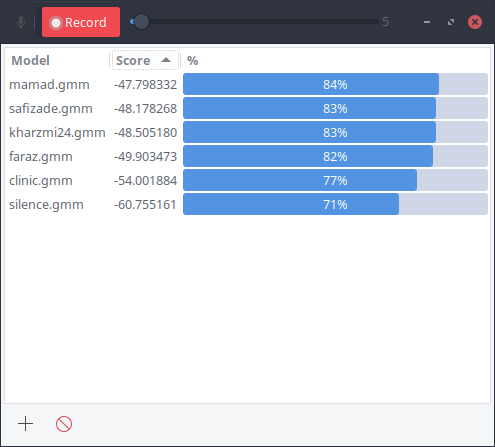

#       September

A text-independent real-time Speaker Recognition system written in ANSI C.

## Installation
**1. Install the dependencies**

- [SPTK] and [SPTK-devel]

- [OpenAL]

- [GNU Make]

- GTK+3.14

**2. Compile it:**  `make`

**3. Enjoy :)**

[SPTK]: http://sp-tk.sourceforge.net/
[SPTK-devel]: https://github.com/r9y9/SPTK
[OpenAL]: https://openal.org/downloads/
[GNU Make]: https://www.gnu.org/software/make/

## Contributing
1. Fork it!
2. Create your feature branch:  `git checkout -b my-new-feature`
3. Commit your changes:  `git commit -am 'Add some feature'`
4. Push to the branch:  `git push origin my-new-feature`
5. Submit a pull request :D

